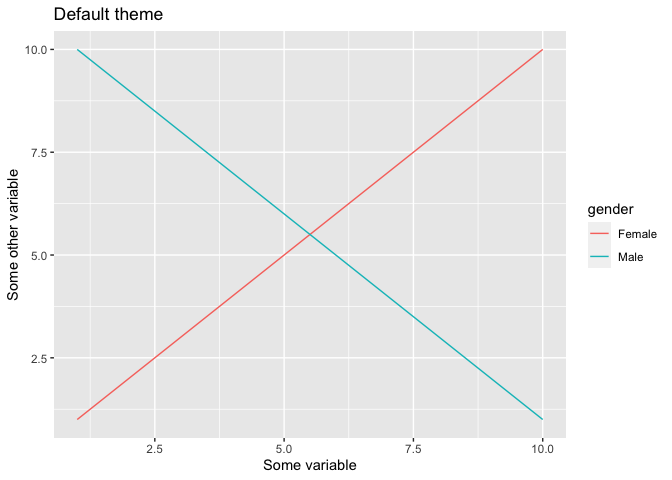
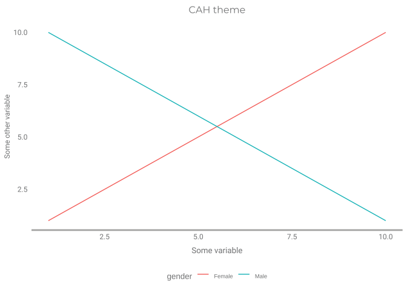

<!-- Edit this here to prevent git errors on the topic: lkajsdf -->
<!-- README.md is generated from README.Rmd. Please edit that file -->

# cah

<!-- badges: start -->
<!-- badges: end -->

IMPORTANT: THIS PACKAGE IS UNDER DEVELOPMENT.

The `cah` package contains useful tools for CAHers. The two main
categories of tools are: tools that make statistical analysis easier,
and tools that make collaboration easier. In addition, there’s tools
that help with research project coorination, etc.

## Installation

You can install the development version of cah from
[GitHub](https://github.com/) with:

``` r
# install.packages("devtools")
devtools::install_github("janlindemans/cah", build_vignettes = TRUE)
```

## Set up

<!-- COPY from vignette: edit original there -->

### Box Sync and Google Drive

Several `cah` functions read files in the CAH Box and Drive folders.
Rather than reading in the files via the Box and Drive APIs, `cah`
assumes you have Box Sync and Google Drive on your desktop (which
everybody is supposed to have in any case). If you don’t have Box Sync
and/or Google Drive installed and running on this computer, you can
click the following links for info about [Box
Sync](https://support.box.com/hc/en-us/articles/360043697194-Installing-Box-Sync)
and/or [Google Drive](https://www.google.com/drive/download/).

### Set global options in .Rprofile

NOTE: IT’S POSSIBLE YOU DON’T (YET) HAVE ACCESS TO THE
`CAH Shared Drive` FOLDER IN GOOGLE DRIVE. IF YOU DON’T, YOU CAN IGNORE
THE INSTRUCTIONS BELOW ABOUT THE GLOBAL OPTION ON THE DRIVE PATH - AND
JUST FOLLOW THE INSTRUCTIONS WITH RESPECT TO BOX.

FOR THE HEALTHERS: WHEN DAN ASKED US TO MOVE OUR `Health Drive` INTO A
FOLDER OWNED BY HIM (SO), I BASICALLY MOVED IT INTO THIS
`CAH Shared Drive` FOLDER. I HAVE NOW ALSO GIVEN YOU ACCESS TO THIS ROOT
FOLDER.

You need to tell `cah` the paths of the CAH Box and Drive folders. In
Box, the folder is called `CAH Shared`; in Drive, it’s called
`CAH Shared Drive`. The paths are different for everybody, but on a Mac
it will look like this:

- `/Users/yourname/Library/CloudStorage/Box-Box/CAH/CAH Shared`
- `/Users/yourname/Library/CloudStorage/GoogleDrive-youremail@gmail.com/.shortcut-targets-by-id/somestring/CAH Shared Drive`

On Windows, it will start with `C:/`: something like
`C:/Users/yourname/...`.

Now specify these paths as global options in your `.Rprofile` file, for
options named `cah.box_path` and `cah.drive_path`. Something like this:

``` r
options(
  cah.box_path = "/Users/yourname/Library/CloudStorage/Box-Box/CAH/CAH Shared",
  cah.drive_path = "/Users/yourname/Library/CloudStorage/GoogleDrive-youremail@gmail.com/.shortcut-targets-by-id/somestring/CAH Shared Drive"
)
```

If you haven’t used `.Rprofile` before, it’s a hidden file with code
that R runs at startup. It should be located in your home/user folder
(e.g., `Users/yourname/.Rprofile`). Learn more about `.Rprofile` on the
[Posit Support
page](https://support.posit.co/hc/en-us/articles/360047157094-Managing-R-with-Rprofile-Renviron-Rprofile-site-Renviron-site-rsession-conf-and-repos-conf).

For the options you just set in your Rprofile to take effect, you will
need to restart R. On restarting, R will read in your Rprofile, with the
edited options. On loading the `cah` package, it will read in your
options, so the `cah` functions know your paths. (Alternatively, you
could manually run the `options(*)` code chunk, and then use
`cah_set_options(force = TRUE)` to force `cah` to read in the latest
options.)

### Install the `better` package

If you want to make guesstimates about the impact of health nudges, you
can use [the `better` package](https://github.com/janlindemans/better).
`cah` will take care of a bunch of things in the background: `better`
makes use of Global Burden of Disease data for its guesstimates, and
`cah` makes sure your global options point `better` towards the dataset
downloaded in CAH Box. So you’ll be all good to go.

`cah` helps you install it easily:

``` r
cah_install(better)
```

Note that `cah` has taken care of the global options for `better`.

``` r
library(cah)
#> Setting path options:
#>   better.gbd_path = /Users/jwl38/Library/CloudStorage/Box-Box/CAH/CAH Shared/IRB Projects/Health Projects/Health Team/Public datasets on health/Global Burden of Disease Study Data
#> 
#> Setting other options.
#> 
#> Welcome to the cah package!
#> To learn more, read the vignette with `cah_vignette()`.
getOption("better.gbd_path")
#> [1] "/Users/jwl38/Library/CloudStorage/Box-Box/CAH/CAH Shared/IRB Projects/Health Projects/Health Team/Public datasets on health/Global Burden of Disease Study Data"
nrow(better::gbd_data()) # read GBD data; check how many rows
#> Getting path from `getOption("better.gbd_path")`.
#> This message is displayed once per session.
#>   Path found:
#> /Users/jwl38/Library/CloudStorage/Box-Box/CAH/CAH Shared/IRB Projects/Health
#>   Projects/Health Team/Public datasets on health/Global Burden of Disease Study
#>   Data
#> Getting GBD dataset from object `gbd`.
#> Object `gbd` not found. Loading GBD dataset and assigning it to `gbd`.
#> Reading GBD data with codebook:
#>   /Users/jwl38/Library/CloudStorage/Box-Box/CAH/CAH Shared/IRB Projects/Health
#> Projects/Health Team/Public datasets on health/Global Burden of Disease Study
#> Data/gbd.rds
#> Loaded GBD data with codebook, assigned to global variable `gbd`, and invisibly returning it.
#> 
#> This message is displayed once per session.
#> [1] 3201778
```

`better` found the Global Burden of Disease data in CAH Box, yay!

<!-- END COPY -->

## Usage

<!-- COPY from vignette: edit original there -->

Now you’re set up to use `better`!

<!-- COPY from better vignette, from the Quick Intro part: edit original there -->

The main purpose of `better` is to help you better guesstimate the
effect of health nudges, that is, behavioral interventions targeted at
health behaviors.

Imagine you are designing a public health campaign. You are thinking
about focusing on preventing cardiovascular diseases, and you are
considering making information about healthy lifestyle more accessible.
What effects can you expect from a campaign like that?

This is how we would make a guesstimate with `better`. Let’s load it,
and let’s also load `tidyverse`, so we can use pipes and other tidy
constructions.

``` r
library(better)
library(tidyverse)
```

Then, we tell `better::nudge` what kind of nudge we are envisioning: in
our case `"information"`. We pipe the result into `better::disease` and
tell it what disease we are targeting: `"cardiovascular diseases"`.

``` r
nudge("information") %>% 
  disease("cardiovascular diseases")
#> Important: This is a guesstimate. Although based on aggregated data, it is no substitute for a rigorous impact analysis when it is worth the effort.
#> 
#>   Effect:
#> 
#> 1,630 DALYs per 100,000 people; 95% CI [502; 3,029]
#> 
#>   Parameters:
#> 
#> behavior = health, nudge = information, cause = cardiovascular diseases, rei =
#> behavioral risks, metric = rate, measure = DALYs, location = Global, sex = both,
#> age = all ages, year = 2019
#> 
#>   Explanation:
#> 
#> We previously estimated that the percentage decrease in exposure to behavioral
#> risks is 61.1 percent, 95% CI [21.1, 100.0]. We also know that at 15.3%,
#> exposure to behavioral risks costs 2,668 DALYs per 100,000 people due to
#> cardiovascular diseases. That is, we know from the GBD data that in 2019, g...
#> [TRUNCATED]
#> ...630 DALYs per 100,000 people; 95% CI [502; 3,029].
#> 
#> See:
#> Global Burden of Disease Collaborative Network. Global Burden of
#> Disease Study 2019 (GBD 2019) Results. Seattle, United States:
#> Institute for Health Metrics and Evaluation (IHME), 2020. Available from
#> https://vizhub.healthdata.org/gbd-results/.
#> 
#>   Terms:
#> 
#> Source: Institute for Health Metrics and Evaluation. Used with permission.
#> All rights reserved. For details, including how to cite the source, call
#> `gbd_license()`.
```

You get some rich output, but the main thing is the number below
“Value”: 1,630 DALYs. What does it mean? If we’re going to roll out an
information nudge in 100,000 people, targeted at cardiovascular
diseases, we’re expected to boost disability adjusted life years by
about 1,630 years. Note that DALYs (disability adjusted life years)
refers to healthy life years - life years without disease or disability.

Now, to get the estimate, we called two functions: `nudge()` and
`disease()`. That’s because we first guesstimate the effect of the nudge
on behavior, and then we guesstimate the effect of behavior on disease
(DALYs). You can check out the effect of the nudge on behavior by only
calling the first function:

``` r
nudge("information")
#> Important: This is a guesstimate. Although based on aggregated data, it is no substitute for a rigorous impact analysis when it is worth the effort.
#> 
#>   Effect:
#> 
#> 0.26 standard deviations, 95% CI [0.09, 0.43]
#> 
#>   Parameters:
#> 
#> rei = behavioral risks, location = Global, behavior = health, nudge =
#> information
#> 
#>   Explanation:
#> 
#> This statistic comes from a meta-analysis on the effectiveness of nudging.
#> This is the abstract of the original paper: "Over the past decade, choice
#> architecture interventions or socalled nudges have received widespread attention
#> from both researchers and policy makers. Built on insights from the be...
#> [TRUNCATED]
#> ...y making."
#> 
#> See:
#> Mertens, S., Herberz, M., Hahnel, U. J. J., & Brosch, T. (2022). The
#> effectiveness of nudging: A meta-analysis of choice architecture interventions
#> across behavioral domains. Proceedings of the National Academy of Sciences,
#> 119(1), e2107346118. https://doi.org/10.1073/pnas.2107346118
```

The philosophy of `better` is to create pipes of guesstimate functions,
like `nudge()` and `disease()`, to get a more complicated guesstimate
consisting of multiple steps. We can get the full explanation of the
guesstimate with `better::explanation()`:

``` r
nudge("information") %>% 
  disease("cardiovascular diseases") %>%
  explanation
#> Step 1:
#> 
#> Estimate: Cohen's d for nudge category "information" and behavior category
#> "health" is 0.26, 95% CI [0.09, 0.43].
#> 
#> This statistic comes from a meta-analysis on the effectiveness of nudging.
#> This is the abstract of the original paper: "Over the past decade, choice
#> architecture interventions or socalled nudges have received widespread attention
#> from both researchers and policy makers. Built on insights from the behavioral
#> sciences, this class of behavioral interventions focuses on the design of
#> choice environments that facilitate personally and socially desirable decisions
#> without restricting people in their freedom of choice. Drawing on more than
#> 200 studies reporting over 440 effect sizes (n = 2,148,439), we present a
#> comprehensive analysis of the effectiveness of choice architecture interventions
#> across techniques, behavioral domains, and contextual study characteristics.
#> Our results show that choice architecture interventions overall promote behavior
#> change with a small to medium effect size of Cohen's d = 0.43 (95% CI [0.38,
#> 0.48]). In addition, we find that the effectiveness of choice architecture
#> interventions varies significantly as a function of technique and domain. Across
#> behavioral domains, interventions that target the organization and structure of
#> choice alternatives (decision structure) consistently outperform interventions
#> that focus on the description of alternatives (decision information) or the
#> reinforcement of behavioral intentions (decision assistance). Food choices
#> are particularly responsive to choice architecture interventions, with effect
#> sizes up to 2.5 times larger than those in other behavioral domains. Overall,
#> choice architecture interventions affect behavior relatively independently
#> of contextual study characteristics such as the geographical location or the
#> target population of the intervention. Our analysis further reveals a moderate
#> publication bias toward positive results in the literature. We end with a
#> discussion of the implications of our findings for theory and behaviorally
#> informed policy making."
#> 
#> See:
#> Mertens, S., Herberz, M., Hahnel, U. J. J., & Brosch, T. (2022). The
#> effectiveness of nudging: A meta-analysis of choice architecture interventions
#> across behavioral domains. Proceedings of the National Academy of Sciences,
#> 119(1), e2107346118. https://doi.org/10.1073/pnas.2107346118
#> 
#> Step 2:
#> 
#> Estimate: The percentage decrease in behavioral risks exposure is 61.1 percent,
#> 95% CI [21.1, 100.0].
#> 
#> Note: If the estimate has a minus sign, it indicates an increase in behavioral
#> risks.
#> 
#> We derive the estimate from the Cohen's d for nudge category "information"
#> and behavior category "health", which is 0.26, 95% CI [0.09, 0.43]. Now, to
#> calculate the percentage decrease, we make use of data on exposure to behavioral
#> risks from the Global Burden of Disease study (GBD). The GBD codebook defines
#> the Summary Exposure Value (SEV) as a measure of a population's exposure to a
#> risk factor that takes into account the extent of exposure by risk level and
#> the severity of that risk's contribution to disease burden. SEV takes the value
#> zero when no excess risk for a population exists and the value one when the
#> population is at the highest level of risk. They report SEV on a scale from
#> 0% to 100% to emphasize that it is risk-weighted prevalence. So, exposure is
#> here a proportion. Since exposure is not a numeric variable, we can't use a
#> traditional Cohen's d. However, Cohen's d essentially describes the effect in
#> terms of standard deviations. For proportions, the standard deviation equals
#> the square root of p*(1-p), where p is the proportion. (For computational
#> simplicity, we assume Cohen's d is calculated using the standard deviation of
#> the control group, without a behavioral nudge, rather than the pooled standard
#> deviation.) We get the baseline proportion from the GBD dataset. According to
#> this dataset, in 2019, globally, the estimated exposure to behavioral risks,
#> for both men and women of all ages, was 15.3 percent, 95% CI [13.1, 17.8].
#> The standard deviation is then sqrt(p*(1-p)), that is, 36.0 percentage points.
#> (Note that we chose not to add an extra confidence interval here for the error
#> on the baseline proportion, because `behavior_pct_to_disease()` already adds a
#> confidence interval based on GBD data error.) The percentage point difference
#> (decrease) is then simply the Cohen's d and its confidence interval multiplied
#> by this standard deviation. That tells us the percentage point decrease in
#> exposure to behavioral risks is 9.37 percentage points, 95% CI [3.24, 15.49].
#> So, exposure to behavioral risks drops from 15.33 percent without nudge, to 5.97
#> percent, 95% CI [0.00, 12.09] with nudge. Note: If the jump from Cohen's d to
#> proportions is difficult to follow, think of proportion data, like the Summary
#> Exposure Value data, as numeric data with two values: 0 and 1. You can calculate
#> the mean of that (bivalent) numeric variable as usual: you would find it equals
#> the proportion. You can also calculate the standard deviation as usual: you
#> would find it equals sqrt(p*(1-p)). Since we have two groups - a control group
#> and a nudged group - you can also calculate Cohen's d as usual.
#> 
#> The last step is to translate this percentage point decrease into a percentage
#> decrease. Now, a percentage decrease is just the percentage points decrease
#> divided by the baseline proportion, that is, 9.37 percentage points, 95% CI
#> [3.24, 15.49], divided by 15.33. This tells us the percentage decrease is 61.1
#> percent, 95% CI [21.1, 100.0].
#> 
#> See:
#> Global Burden of Disease Collaborative Network. Global Burden of
#> Disease Study 2019 (GBD 2019) Results. Seattle, United States:
#> Institute for Health Metrics and Evaluation (IHME), 2020. Available from
#> https://vizhub.healthdata.org/gbd-results/.
#> 
#> Step 3:
#> 
#> Estimate: A behavioral intervention in nudge category "information" and behavior
#> category "health" that targets cardiovascular diseases saves 1,630 DALYs per
#> 100,000 people; 95% CI [502; 3,029].
#> 
#> We previously estimated that the percentage decrease in exposure to behavioral
#> risks is 61.1 percent, 95% CI [21.1, 100.0]. We also know that at 15.3%,
#> exposure to behavioral risks costs 2,668 DALYs per 100,000 people due to
#> cardiovascular diseases. That is, we know from the GBD data that in 2019,
#> globally, the estimated cost of cardiovascular diseases due to behavioral risks,
#> for both men and women of all ages, was 2,668 DALYs per 100,000 people; 95% CI
#> [2,375; 3,029]. The last step is to take 61.1 percent, 95% CI [21.1, 100.0], of
#> 2,668 DALYs; 95% CI [2,375; 3,029], and to combine both confidence intervals.
#> That gives us the estimate that the nudge saves 1,630 DALYs per 100,000 people;
#> 95% CI [502; 3,029].
#> 
#> See:
#> Global Burden of Disease Collaborative Network. Global Burden of
#> Disease Study 2019 (GBD 2019) Results. Seattle, United States:
#> Institute for Health Metrics and Evaluation (IHME), 2020. Available from
#> https://vizhub.healthdata.org/gbd-results/.
```

This output also shows you that there was an intermediate step in the
calculation.

Let’s see what happens if we would shift the focus of our intervention
to diabetes and kidney diseases. To simplify the output, I use
`better::effect_only`. It prints only the effect, leaving out the
parameters and explanation.

``` r
nudge("information") %>%
  disease("diabetes and kidney diseases") %>%
  effect_only
#> Important: This is a guesstimate. Although based on aggregated data, it is no substitute for a rigorous impact analysis when it is worth the effort.
#> 251.5 DALYs per 100,000 people, 95% CI [69.5, 505.5]
```

What if we tried a structural nudge?

``` r
nudge("structure") %>%
  disease("diabetes and kidney diseases") %>%
  effect_only
#> Important: This is a guesstimate. Although based on aggregated data, it is no substitute for a rigorous impact analysis when it is worth the effort.
#> 412 DALYs per 100,000 people, 95% CI [224, 506]
```

What if we wanted to see the impact on deaths?

``` r
nudge("structure") %>%
  disease("diabetes and kidney diseases", measure = "deaths") %>%
  effect_only
#> Important: This is a guesstimate. Although based on aggregated data, it is no substitute for a rigorous impact analysis when it is worth the effort.
#> 9.44 deaths per 100,000 people, 95% CI [5.47, 11.09]
```

You can also get quick power calculations. Say you want to run an
experiment, testing the information nudge, with two conditions: a
treatment, and a control. You hypothesize the nudge will decrease risky
behaviors. How many observations do you need in each condition?

``` r
nudge("information") %>% 
  sample_size
#> 
#>      Two-sample t test power calculation 
#> 
#>               n = 183.596
#>               d = -0.26
#>       sig.level = 0.05
#>           power = 0.8
#>     alternative = less
#> 
#> NOTE: n is number in *each* group
```

So, you need about 184 observations per condition. You may recognize
this kind of output. It’s the output of `pwr.t.test()` from the `pwr`
package, because `sample_size()` wraps that function.

Alternatively, you may want to be sufficiently powered to discern an
impact on health - say on the death rate.

Of course you need a much larger sample to be able to detect a
difference in mortality.

<!-- END COPY from better vignette: edit original there -->

For more information on `better`, check out the vignette with
`vignette("better")`.

## CAH graphs

You can plot `ggplot` graphs in CAH house style with `theme_cah()`. Use
it like any other `ggplot` theme.

``` r
library(ggplot2)
p1 <- tibble(
  gender = c(rep("Male",10),rep("Female",10)),
  x = c(1:10,1:10),
  y = c(10:1,1:10)
  ) %>%
  ggplot(aes(x,y,color=gender)) +
  geom_line() +
  labs(x = "Some variable", y = "Some other variable")
p1 + 
  labs(title = "Default theme")
```



``` r
p1 + 
  labs(title = "CAH theme") + 
  theme_cah()
```



## CAH paths

`cah` helps you with paths to commonly used files. You can retrieve a
dataframe with the available files with `cah::cah_files`:

``` r
library(cah)
cah_files()
#> # A tibble: 5 × 5
#>   short          name                                parent          path  orig 
#>   <chr>          <chr>                               <chr>           <chr> <chr>
#> 1 box            CAH Shared                          CAH             /Use… cah  
#> 2 drive          CAH Shared Drive                    CAH             /Use… cah  
#> 3 gbd            Global Burden of Disease Study Data Public dataset… /Use… bett…
#> 4 health         Health Projects                     IRB Projects    /Use… cah  
#> 5 projects_sheet CAH Projects.xlsx                   Health Team pr… /Use… cah
```

Several `cah` functions allow you to feed it the short name of the file,
unquoted:

``` r
cah_files(box)
#> # A tibble: 1 × 5
#>   short name       parent path                                             orig 
#>   <chr> <chr>      <chr>  <chr>                                            <chr>
#> 1 box   CAH Shared CAH    /Users/jwl38/Library/CloudStorage/Box-Box/CAH/C… cah
cah_path(box)
#> [1] "/Users/jwl38/Library/CloudStorage/Box-Box/CAH/CAH Shared"
cah_files(projects_sheet)
#> # A tibble: 1 × 5
#>   short          name              parent                path              orig 
#>   <chr>          <chr>             <chr>                 <chr>             <chr>
#> 1 projects_sheet CAH Projects.xlsx Health Team principal /Users/jwl38/Lib… cah
cah_path(projects_sheet)
#> [1] "/Users/jwl38/Library/CloudStorage/Box-Box/CAH/CAH Shared/IRB Projects/Health Projects/Health Team/Health Team principal/CAH Projects.xlsx"
```

You could for instance use it to read in a sheet:

``` r
readxl::read_excel(cah_path(projects_sheet))
#> Warning in read_fun(path = path, sheet_i = sheet, limits = limits, shim =
#> shim, : NA inserted for an unsupported date prior to 1900
#> # A tibble: 87 × 46
#>    team  current_project_status project   brief…¹ resea…² funder quarter quart…³
#>    <chr> <chr>                  <chr>     <chr>   <chr>   <chr>  <chr>   <chr>  
#>  1 Money Complete               CCL Glob… "For s… Hans F… MetLi… Q1 2022 "We ha…
#>  2 Money Complete               DMFS: CEF "This … Jiayu … MetLi… Q1 2022 "The s…
#>  3 Money Complete               DMFS: VA… "In co… Stefan… Metli… Q1 2022 "The p…
#>  4 Money Complete               DMFS: Sc… "We te… Kahini… MetLi… Q1 2022 "Contr…
#>  5 Money Complete               Alight    "This … Perry … MetLi… Q1 2022 "The s…
#>  6 Money Complete               Qapital:… "This … Jiayu … MetLi… Q1 2022 "We co…
#>  7 Money Complete               Pru WSG   "We ar… Jianna… Prude… Q1 2022 "In st…
#>  8 Money Complete               Ascensus… "We ar… Margar… MetLi… Q2 2022 "Due t…
#>  9 Money Sharing                Start at… "We ar… Zarak … MetLi… Q1 2022 "We ar…
#> 10 Money Data Analysis          Branch    "This … Stefán… MetLi… Q2 2022 "The e…
#> # … with 77 more rows, 38 more variables: project_start_date <dttm>,
#> #   irb_protocol_number <chr>, osf_link_s <chr>, box_directory_path <chr>,
#> #   data_storage_path <chr>, publication_plans <chr>, journal_name <chr>,
#> #   status <chr>, funded_by_outside_source <chr>, funding_duration <chr>,
#> #   reviewed_by <chr>, name_of_data_use_agreement <chr>,
#> #   comments_optional <chr>, summary_author <chr>, word_count <dbl>,
#> #   is_there_data <chr>, sensitivity_level <chr>, …
```

<!-- END COPY -->

## Vignette

Check out the vignette for more examples on how to use the package:
`vignette("cah")`.
